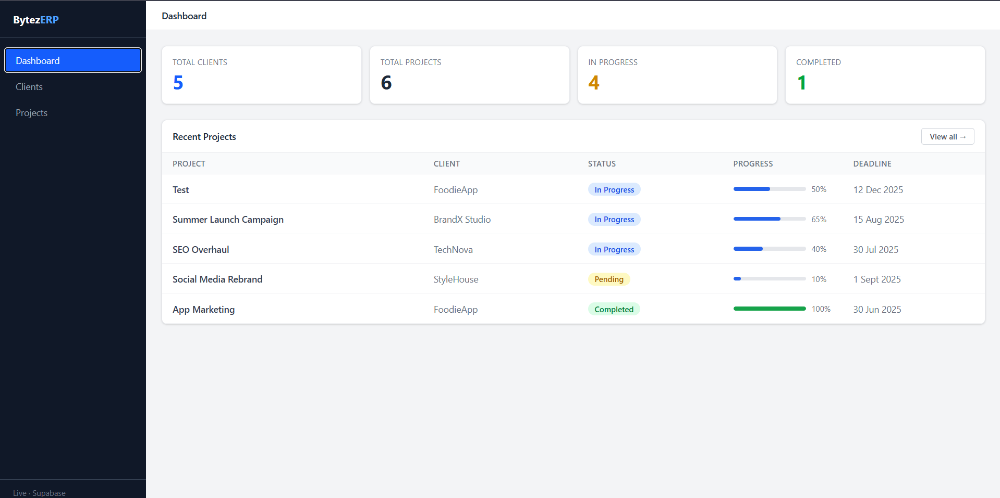

# BytezERP – Client & Project Management Dashboard

A modern **ERP-style dashboard** built with **React, GSAP, and Supabase** for managing clients, projects, and tasks in a clean and responsive interface.

---

# ✨ Features

## 📊 Dashboard
- Overview of business data
- Total clients
- Total projects
- Active projects
- Completed projects
- Pending projects

## 👥 Client Management
- Create new clients
- View all clients
- Delete clients
- Client status management

## 📁 Project Management
- Create projects
- Assign projects to clients
- Track project progress
- Delete projects

## 🎨 Modern UI
- Responsive dashboard layout
- Sidebar navigation
- Mobile-friendly design
- Clean data display

---

# 🛠 Tech Stack

### 🎨 Frontend
- React
- Vite
- Tailwind CSS
- GSAP

### ☁️ Backend / Database
- Supabase

# 🔮 Future Improvements

- Authentication (supabase Auth)
- Role based access (Admin / Employee)
- New Task Page
- New Employee role - view
- Task Allocation to Employee
- Notifications / Toast alerts
- New overall reports page
- Data-Chart Integration on Dsshboard
---
